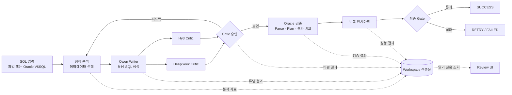
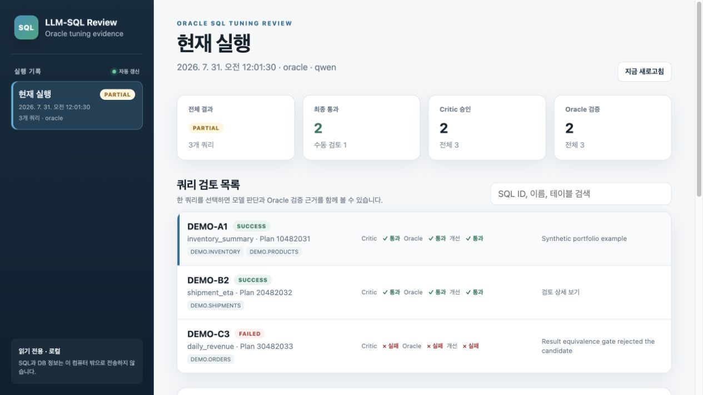

# DGX SQL Tuning

[](https://github.com/qpalzmowksmx/Dgx_Sql_Tuning/actions/workflows/ci.yml)

> Oracle SQL을 외부 SaaS로 전송하지 않고, 로컬 LLM과 Oracle 검증을 결합해
> **분석 → 튜닝 → 비평 → 검증 → 벤치마크**를 자동화한 온프레미스 SQL 튜닝 플랫폼


_프로젝트의 데이터 흐름을 표현한 개념 일러스트입니다._

## 프로젝트 소개

DGX SQL Tuning은 민감한 SQL과 데이터베이스 메타데이터를 내부 환경에 유지하면서
Oracle SQL 튜닝 과정을 자동화하기 위해 만든 포트폴리오 프로젝트입니다.

Qwen이 튜닝 초안을 작성하고 DeepSeek V4 Flash와 Hy3가 독립적으로 결과를
비평합니다. 모델이 승인한 SQL도 곧바로 채택하지 않고 Oracle parse, 실행계획,
결과 동등성, 성능 측정을 통과한 경우에만 성공으로 판정합니다.

파일 기반 오프라인 분석과 Oracle `V$SQL` 수집 모드를 모두 지원하며, 대형 모델을
동시에 적재하기 어려운 단일 DGX 환경을 고려해 모델을 순차적으로 교체할 수 있도록
구성했습니다.

## 핵심 구현

- **다중 모델 검증 루프**
  Qwen writer가 SQL을 재작성하고 DeepSeek·Hy3 critic이 의미 보존, Oracle 문법,
  카디널리티 증가, DB Link 및 scalar subquery 위험을 독립적으로 검토합니다.

- **Fail-closed 파이프라인**
  모델 응답, JSON Schema, Oracle 검증 또는 최종 gate 중 하나라도 실패하면 결과를
  자동 승인하지 않습니다.

- **Oracle 기반 최종 검증**
  선택적으로 parse, `EXPLAIN PLAN`, 동일 트랜잭션 내 원본·튜닝 결과 비교,
  반복 벤치마크를 수행합니다.

- **구조화된 모델 통신**
  writer와 critic 응답을 JSON Schema로 제한하고, 생성 후 다시 검증해 자유 형식
  출력으로 인한 파이프라인 오류를 줄였습니다.

- **DGX Spark 로컬 모델 운영**
  Qwen, DeepSeek V4 Flash, Hy3의 llama.cpp Docker 구성을 분리하고 공통
  `modelctl.sh`로 시작·중지·교체합니다.

- **읽기 전용 Review UI**
  실행 결과, critic 의견, Oracle 검증, 성능 비교를 로컬 웹 화면으로 확인하며,
  workspace 외부 파일 접근과 경로 순회를 차단합니다.

## 시스템 아키텍처



### 처리 상태

```text
COLLECT_SQL
  → COLLECT_METADATA
  → BUILD_RAG
  → ANALYZE
  → TUNE
  → CRITIQUE
  → VALIDATE_ORACLE
  → BENCHMARK
  → VERIFY
  → SUCCESS / REANALYZE / FAILED
```

## 모델 구성

| 역할 | 모델 경로 | 주요 책임 |
|---|---|---|
| Writer | `Llamacpp/Qwen` | 원본 SQL 분석 및 튜닝 후보 작성 |
| Critic 1 | `Llamacpp/DeepSeekV4FlashDgxSpark` | 의미·문법·카디널리티·Oracle 위험 검토 |
| Critic 2 | `Llamacpp/Hy3` | 독립적인 2차 비평 및 reasoning 검증 |
| Final gate | Oracle | Parse, plan, 결과 동등성 및 성능 검증 |
세 모델 서버는 기본적으로 `127.0.0.1:8080`을 사용합니다. 단일 DGX에서 포트와
통합 메모리를 공유하므로 한 번에 하나의 모델 stack만 실행하는 것을 전제로 합니다.

## 디렉터리 구조

```text
Dgx_Sql_Tuning/
├── AutorunEnum_Final/       # SQL 튜닝 상태 머신과 Oracle 검증 파이프라인
│   ├── main.py              # CLI 진입점
│   ├── PipelineManager.py   # 수집·분석·튜닝·비평·검증 orchestration
│   ├── run_files.sh         # 파일 기반 SQL 튜닝
│   ├── run_oracle.sh        # Oracle 수집 및 검증 실행
│   └── tests/               # 계약·보안·상태 전이 테스트
├── Llamacpp/
│   ├── Qwen/                # Qwen writer 서버
│   ├── DeepSeekV4FlashDgxSpark/
│   │                         # DGX Spark용 DeepSeek critic 서버
│   ├── Hy3/                 # Hy3 critic 및 reasoning 구성
│   └── modelctl.sh          # 모델 stack 공통 제어
├── OutlinePass/             # SQL outline 추출 보조 도구
├── ReviewUI/                # 실행 결과 읽기 전용 웹 대시보드
├── contracts/               # writer·critic·DB context JSON Schema
├── db_context/              # 공개 가능한 DB context 예제
├── txt/                     # writer·critic 시스템 프롬프트
└── docs/assets/             # README용 공개 이미지
```

## 기술적 설계 포인트

### 1. LLM 결과를 신뢰하지 않는 구조

LLM이 생성한 SQL은 다음 gate를 순서대로 통과해야 합니다.

1. JSON 응답 계약 검증
2. SQL 안전 정책 검사
3. 복수 critic 승인
4. Oracle parse 및 실행계획 검증
5. 원본·튜닝 결과 동등성 비교
6. 설정한 성능 개선 기준 확인

검증 자료가 부족하거나 응답이 잘리거나 모델 endpoint가 없으면 추정으로 진행하지
않고 실패 상태로 종료합니다.

### 2. 민감정보 보호

- SQL, DB context, workspace, 로그와 벤치마크 결과는 Git에서 제외
- `.env`와 `config.env`에는 실제 자격증명 저장, 예제 파일만 공개
- 신규 runtime 파일은 기본적으로 제한된 권한으로 생성
- Review UI는 기본적으로 loopback에만 bind
- 절대 경로와 workspace 밖 artifact 접근 차단
- root 권한 실행을 기본 거부

### 3. 재현 가능한 모델 실행

- 모델별 Docker Compose 및 native 실행 스크립트 분리
- 모델 repository, revision, context, KV cache 설정을 예제 환경파일로 관리
- health check, smoke test, manifest, benchmark 스크립트 제공
- offline 실행 시 자동 pull/build를 제한하는 검증 테스트 포함

### 4. 동적 DB Context

실제 스키마 전체를 prompt에 고정하지 않습니다. 쿼리에서 참조하는 객체와 dependency만
선택하여 모델에 전달하며, 누락된 메타데이터는 모델이 추측하지 못하도록 prompt와
검증 로직 양쪽에서 제한합니다.

## 빠른 시작

### 요구사항

- Python 3.10 이상
- Docker 및 Docker Compose
- NVIDIA DGX Spark 또는 CUDA 실행 환경
- Oracle Database 19c 연결 환경 — Oracle 모드 사용 시

### Python 환경

```bash
git clone https://github.com/qpalzmowksmx/Dgx_Sql_Tuning.git
cd Dgx_Sql_Tuning

python3 -m venv .venv
source .venv/bin/activate

python -m pip install \
  -r AutorunEnum_Final/requirements.txt \
  -r ReviewUI/requirements.txt
```

### 모델 설정

```bash
cp Llamacpp/Qwen/config.env.example Llamacpp/Qwen/config.env
cp Llamacpp/DeepSeekV4FlashDgxSpark/config.env.example \
   Llamacpp/DeepSeekV4FlashDgxSpark/config.env
cp Llamacpp/Hy3/config.env.example Llamacpp/Hy3/config.env
```

각 `config.env`에서 모델 경로, revision, context와 로컬 token 값을 확인합니다.
실제 token이 필요하지 않은 공개 모델은 해당 값을 비워둘 수 있습니다.

### 모델 제어

```bash
cd Llamacpp

./modelctl.sh start Qwen
./modelctl.sh status
./modelctl.sh stop
```

사용 가능한 이름:

```text
Qwen
DeepSeekV4FlashDgxSpark
Hy3
```

### 파일 기반 SQL 튜닝

실제 SQL 디렉터리는 저장소 밖 또는 Git에서 제외된 경로를 사용합니다.

```bash
SOURCE_DIR=/path/to/private-sql ./AutorunEnum_Final/run_files.sh
```

여러 디렉터리를 사용할 때:

```bash
SOURCE_DIRS='/path/to/sql-a:/path/to/sql-b' \
  ./AutorunEnum_Final/run_files.sh
```

### Oracle 모드

```bash
cp AutorunEnum_Final/.env.example AutorunEnum_Final/.env
```

`.env`에서 아래 자리표시자를 실제 내부 값으로 교체합니다.

```env
ORACLE_USER=your-oracle-user
ORACLE_PASSWORD=your-oracle-password
ORACLE_DSN=db-host.example.com:1521/service_name
```

기본 상태에서는 실제 benchmark와 Oracle 검증이 비활성화되어 있습니다.
승인된 테스트 환경에서만 명시적으로 활성화합니다.

```bash
ORACLE_VALIDATE=1 \
EXECUTE_BENCHMARK=1 \
./AutorunEnum_Final/run_oracle.sh
```

### Review UI

```bash
python3 ReviewUI/server.py
```

브라우저에서 `http://127.0.0.1:8765`를 엽니다.

다른 workspace를 검토할 때:

```bash
python3 ReviewUI/server.py --workspace /path/to/private-workspace
```

## 실제 구현 화면



화면은 실제 `ReviewUI/server.py`를 익명화된 합성 workspace로 실행해 캡처했습니다.
표시된 SQL ID, 객체명, 실행시간과 개선율은 UI 시연용 값이며 실제 고객·회사 데이터나
운영 성능 수치가 아닙니다.

## 테스트

```bash
# 핵심 파이프라인 및 보안 계약
python3 -m unittest discover -s AutorunEnum_Final/tests -v

# Review UI 경로 경계와 API
python3 -m unittest discover -s ReviewUI/tests -v

# Docker Compose 정적 검증 예시
docker compose \
  -f Llamacpp/Qwen/docker-compose.yml \
  config --quiet
```

현재 공개본 기준:

- 파이프라인 계약·상태·보안 테스트 **27개**
- Review UI 경로·API 테스트 **6개**
- 모델별 Docker Compose 구성 **10개**

## 기술 스택

| 영역 | 기술 |
|---|---|
| Language | Python, Bash, JavaScript |
| Database | Oracle Database 19c, `python-oracledb` |
| LLM serving | llama.cpp, OpenAI-compatible API |
| Models | Qwen, DeepSeek V4 Flash, Hy3 |
| Infrastructure | NVIDIA DGX Spark, CUDA, Docker Compose |
| Validation | JSON Schema, Oracle parse/plan/result comparison |
| Observability | Prometheus metrics, local Review UI |
| Testing | Python `unittest`, Docker Compose config validation |

## 포트폴리오에서 보여주는 역량

- 다중 LLM을 역할별로 분리한 agentic workflow 설계
- 생성형 AI 결과를 deterministic validation으로 통제하는 fail-closed 시스템
- Oracle 성능 튜닝과 실행계획·결과 동등성 검증 자동화
- 제한된 GPU 메모리를 고려한 대형 모델 순차 운영
- 폐쇄망·온프레미스 환경을 고려한 보안 경계 설계
- Docker Compose, CLI, 테스트, 관측 UI를 포함한 end-to-end 구현
- 공개 저장소와 실제 운영 데이터의 분리 및 secret-safe 구성

## 공개 저장소 범위

이 저장소에는 코드, 공개 prompt, JSON Schema와 안전한 설정 예제만 포함합니다.
다음 자료는 의도적으로 포함하지 않습니다.

- 실제 SQL 및 고객·회사 식별정보
- Oracle 접속정보와 DB metadata
- 모델 다운로드 token과 API key
- 모델 weight, runtime cache와 container image
- 실행 workspace, 로그, benchmark 및 review 결과
- 내부 장비 경로와 사설 repository URL

보안 경계와 취약점 제보 절차는 [SECURITY.md](SECURITY.md)를 참고하세요.

## 제한사항

- DGX별 최적 context와 KV cache 값은 모델·메모리 상태에 따라 다시 측정해야 합니다.
- Oracle 실행 검증은 권한이 통제된 테스트 환경에서만 활성화해야 합니다.
- LLM 승인은 정확성의 근거가 아니며 Oracle 결과 동등성 검증을 대체하지 않습니다.
- 모델과 외부 fork의 라이선스 및 배포 조건은 사용 전에 별도로 확인해야 합니다.

## License

Project source code is distributed under the [MIT License](LICENSE).
Third-party models, forks and container dependencies retain their respective licenses.
